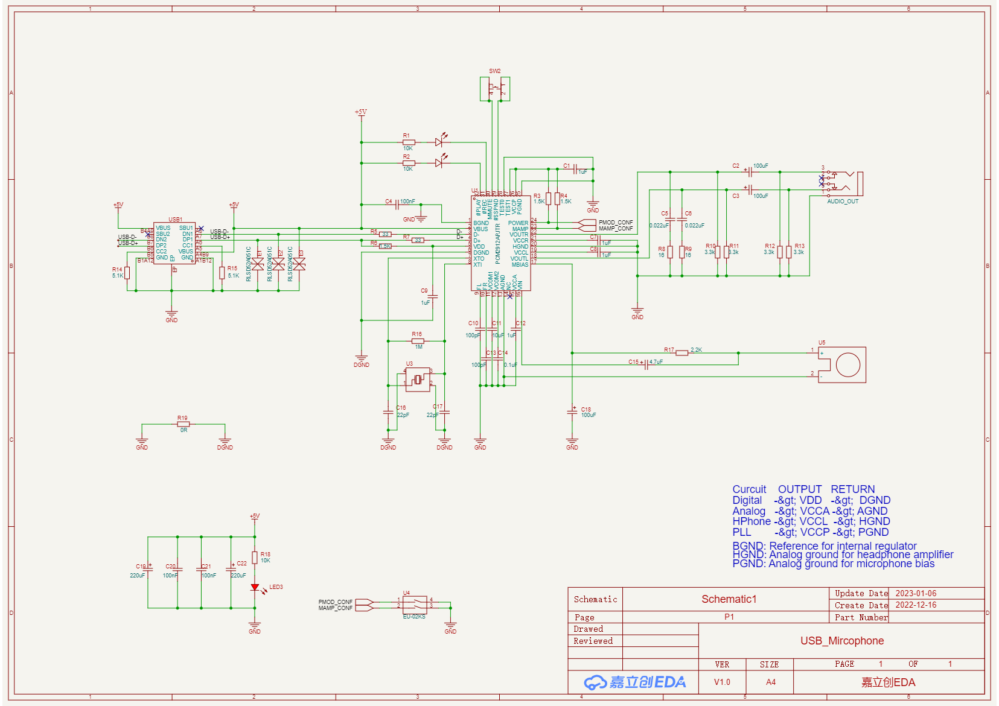
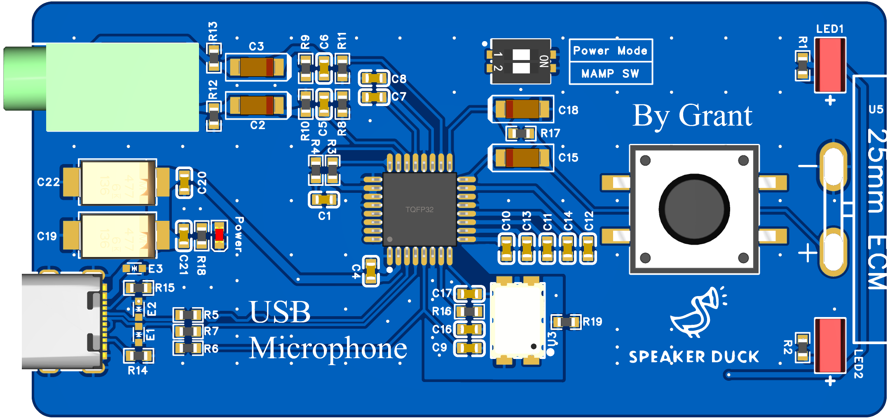
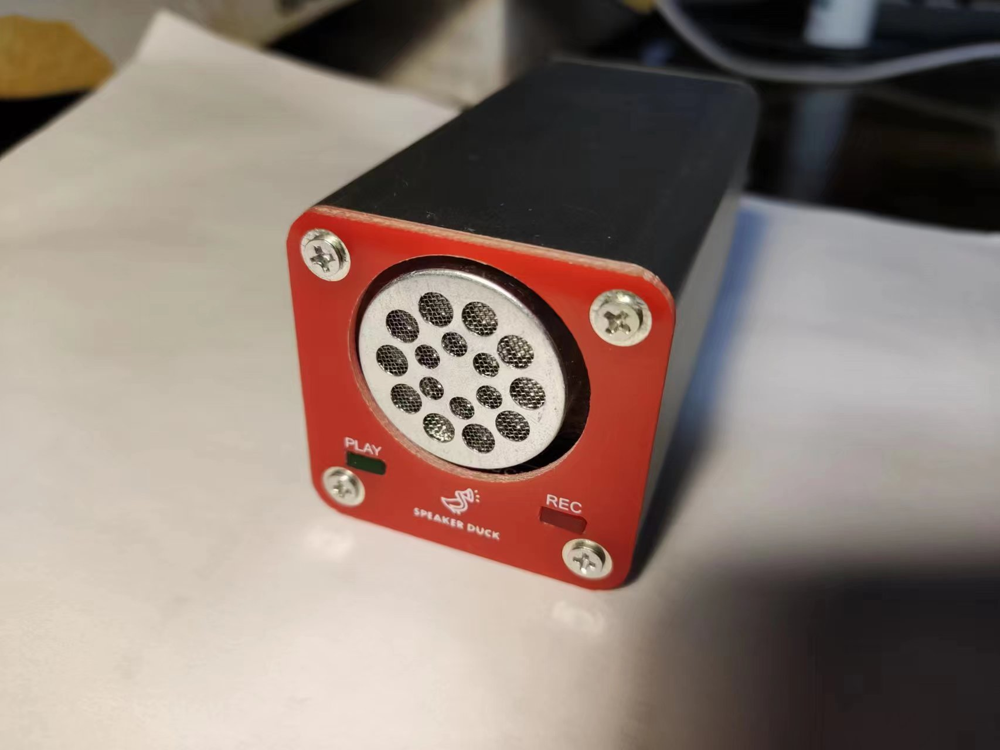
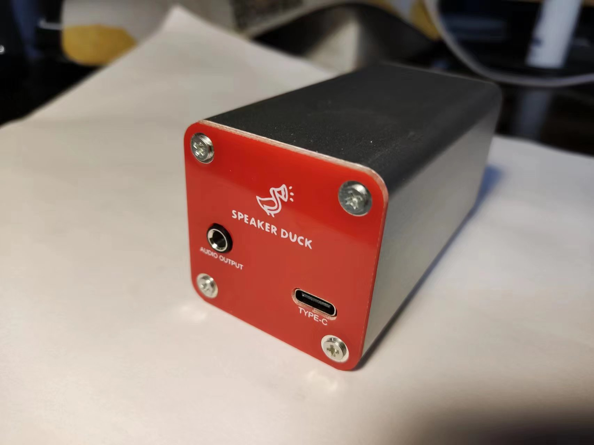
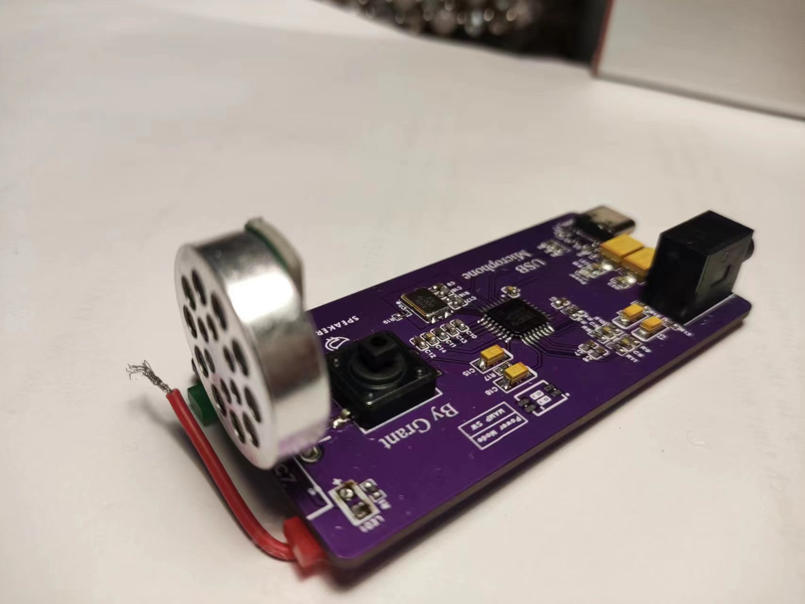

# USB麦克风设计

因为自己的耳麦坏掉了, 并且不满足于耳麦的麦克风音质, 遂产生了自己制作一个桌面USB麦克风的想法. 经过一番对比选型之后, 确定了使用TI的PCM2912A芯片加25mm驻极体麦克风的方案.  

成品的音质还算不错, 只不过因为太灵敏导致了可以收到很微弱的声音, 对使用造成了一定的干扰, 在后续升级中将对整体进行升级.

电路图:

PCB预览:

实物图:

